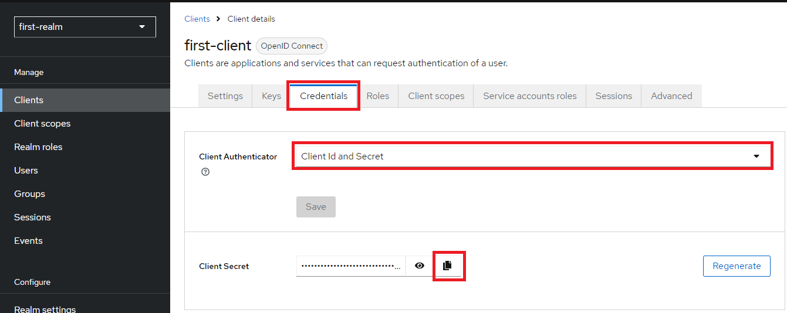

# spring-oauth2-example
```
    Swagger: http://localhost:9001/swagger-ui/index.html
    Keycloak: http://localhost:8080/
    Others requests: .http/requests.http
```

## Setup Keycloak

- Step 1: docker run
```
docker run -p 8080:8080 -e KEYCLOAK_ADMIN=admin -e KEYCLOAK_ADMIN_PASSWORD=admin quay.io/keycloak/keycloak:25.0.0 start-dev
```
- Step 2: criar realm (Ex: first-realm)
- Step 3: criar client para o novo realm (Ex: first-client)
- Step 4: testar em https://www.keycloak.org/app/
- Step 5: habilitar autenticacao por client_credentials




## api-one
Api com seguranca na camada <b>WEB</b> utilizando Spring Security com autenticação integrada ao Keycloak (Autenticação OAuth2 Bearer JWT).

## api-two
Api sem segurança na camada <b>WEB</b>, mas consumindo a ```api-one``` utilizando Open Feign autenticando no Keycloak.